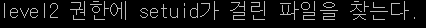
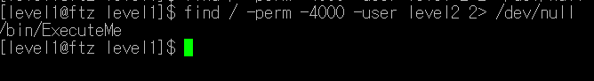
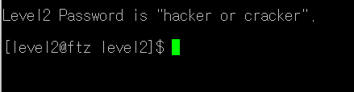

# **Hackerschool FTZ**

## Level1

### /dev/null 리눅스 (keyword)

힌트를 보고 find명령어를 사용하여서 level2 권한의 파일을 찾아야겠다고 생각함. 

find 명령어를 사용하고,  -perm 옵션을 사용해서 SetUID가 걸려있고, 유저이름이 level2인 파일 찾았다.

<aside>
💡 2> /dev/null를 이용해서 에러(오류)없이 필요한 파일만 출력하였다.

</aside>

/bin/ExecuteMe를 열고, bash명령어를 입력한 다음 my-pass를 입력해서, 비밀번호를 찾았다!