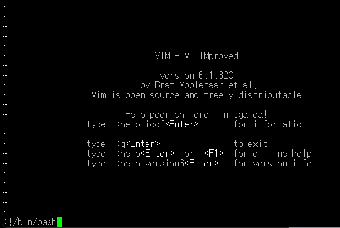

## Level2

### vi editor(key word)

cat hint로 힌트 먼저 보기!

힌트를 보고 일단 텍스트 파일을 편집하는 vi 명령어를 떠올렸고, 후에 **vi 쉘 명령어 실행**이라고 구글링 해보았다.

<aside>
💡 :!를 써서 외부 쉘을 실행

</aside>

위와 같이 써서 외부의 쉘을 실행 시킬수 있다는것을 알고,

일단 find 명령어를 사용해서 setuid가 걸린 level3의 유저이름을 가진 파일을 찾았다.

/usr/bin/editor라는 파일이 나와서, 열어보았다.

그랬더니 위와 같은 화면이 나타났다. 

vi editor라고 생각했고, 그래서 권한을 여기에서 얻어야겠다고 생각하고,

외부 쉘을 실행시키는 :!를 사용해서 :!/bin/bash를 써주었다.

그리고 엔터를 누른뒤 my-pass를 입력해서 다음레벨의 비밀번호를 찾아냈다!

