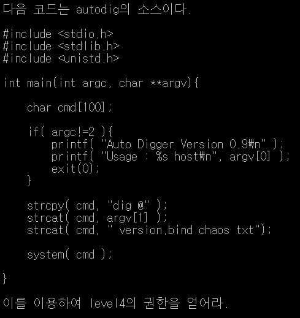
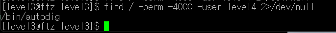

## Level3

### “명령어”(문자열 형태로 전달), ;(동시에 여러 명령어 사용) → (keyword)

먼저 cat hint로 힌트보기!

find 명령어를 사용하여 유저이름이 level4이고 Setuid가 걸린  파일을 먼저 찾는당!

찾았더니 /bin/autodig이라는 파일이 나왔다!

그리고 autodig이라는 파일이 /bin안에 있기때문에 /bin 안에 들어가준다.

그런다음에 more hints를 보면

<aside>
💡 동시에 여러 명령어를 사용하려면? → 명령어 사이에 ;(세미콜론)을 붙여준다.

문자열 형태로 명령어를 전달하려면? → “”(큰따옴표)안에 명령어를 넣어 사용한다. 

</aside>

위를 이용해 my-pass명령어 까지 한번에 실행시키기 위해서 autodig “/bin/bash;my-pass” (bin 안이기 때문에 ./autodig “/bin/bash;my-pass”라고 사용해도 된다.)라고 명령어를 사용하여 level4의 비밀번호를 찾아냈다!

