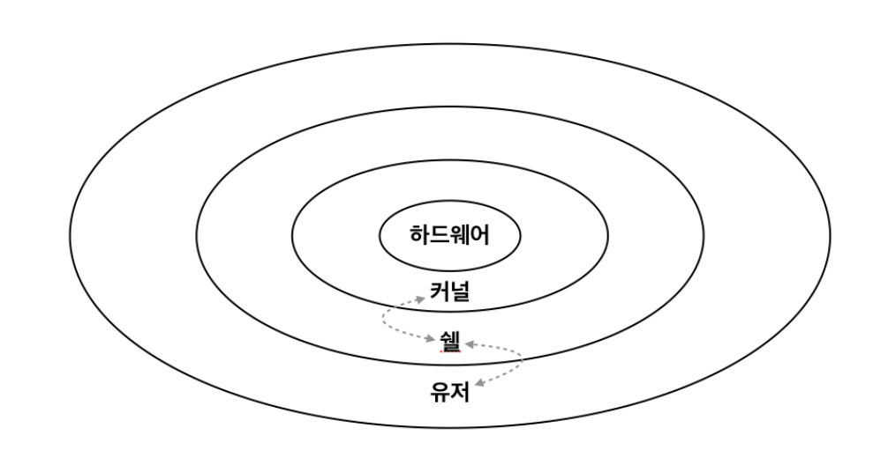

# **Kernel && Shell**

### **커널(kernel)**
---

**커널은 운영체제의 핵심이다.**

**한마디로 소프트웨어와 하드웨어의 커뮤니케이션(communication)을 관리하는 프로그램이다.**

### **쉘(shell)**
---
**사용자와 운영체제간의 대화를 가능하게 해주는 명령어 해석기 역할(→컴파일러와 비슷하다고 생각)**

**사용자명령→쉘(해석)→커널(하드웨어 관리)→쉘(결과를 해석)→사용자에게 결과반환**