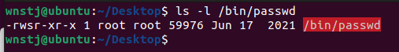

### **Hackerschool FTZ level1 분석해보자**

- **리다이렉션이란??**
    
    표준 입력이나 출력을 꼭 키보드나 화면으로 하는 것이 아닌, 파일로 입력을 받거나 출력 하도록 변경하는 것을 의미함
    
    | > | 표준출력 | 명령 > 파일 명령의 결과를 파일에 저장 |
    | --- | --- | --- |
    | >> | **표준출력(추가)** | **명령 >> 파일 명령의 결과를 파일에 추가** |
    | < |**표준입력**| **파일의 데이터를 명령에 입력** |

- **/dev/null?**
    
    “black hole”로 사용된다. 어떠한 데이터를 이 장치(Device)에 보내면 모두 **없어진다.**
    
    윈도우에서의 휴지통같은 역할
    

- **fsck(file system consistency check)**
    
    리눅스에서의 드라이브 같은것들을 검사하거나 수리해주는것
    

- **/lost+found?**
    
    디스크오류나 부정확한 시스템 종료에 의해 잃어버린 상태가 된 파일들을 찾아내어 lost+found 디렉토리에 저장된다.
    

- **/dev/null 과 /lost+found의 차이점**
    
    <aside>
    💡 위 내용에서 봤을때 /dev/null과 /lost+found의 차이점은 /dev/null은 없애는것, /lost+found는 저장하는것으로 정의 할 수 있는것 같다.
    
    </aside>
    

- **Shell**
    - shell?
        
        리눅스에서의 쉘이란 명령어와 프로그램을 실행할때 사용하는 인터페이스이다.
        
        사용자와 커널 사이에서 명령을 해석해 전달하는 명령어 해석기 기능이 있다.
        
    
    - shell의 종류
        
        C쉘 - C Shell, csh : C언어를 기반으로 만들어진 쉘
        
        Bourne 쉘 - sh : 최초의 본격적인 쉘
        
        bash : 현재 리눅스의 표준 쉘이며 우분투에서도 기본적으로 사용되는 쉘이다
        
        bash 쉘의 특징 : History기능 (**[↑](https://unicode-table.com/kr/2191/)** 또는 **↓**), 연산 기능 등이 있다.
        

- **SetUID, SetGID, StickyBit???**
    
    SetUID : Set User Id
    
    SetGID : Set Group Id
    
    위 비트들이 붙어있는 파일이나 디렉토리를  볼 경우 s로 표시된다.
    
    
    
    파일에서는 사용자 permission에서 ‘s’는 setuid 비트이고, 그룹 permission에서는 setgid비트인 것을 확인 할 수 있다.
    
    위 같은 경우는 /bin/passwd에 setuid 비트가 되어있고, 소유자가 root로 되어있다.
    
    이 프로그램을 실행시 소유자(root)의 권한으로 전환되며, 이와 같은것이 쓰이는 예로는 /etc/shadow파일(사용자들의 비밀번호를 모아둔곳)이 있다.
    
    마찬가지로 setgid 비트가 붙은 프로그램을 실행시 소유그룹의 권한으로 전환이 된다.
    

- **Sticky Bit**
    
    Sticky Bit(1000)가 설정된 디렉토리는 누구나 파일을 만들수가 있지만 자신의 소유의 파일이 아닌경우 삭제할 수 없다.
    
    디렉토리에 Sticky Bit를 붙일때는 누구나 읽고, 쓰고, 실행할 수 있도록 777권한을 부여해야한다.
    
    Sticky Bit가 붙은 유명한 예시는 유닉스의 임시파일을 쓰는 디렉토리인 /tmp이다.