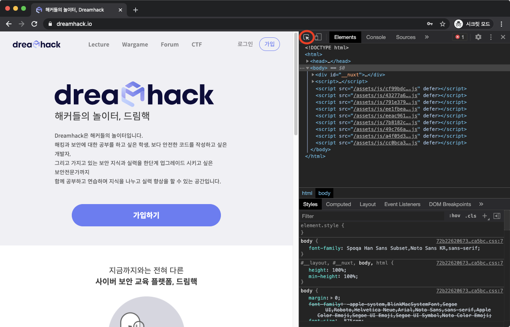
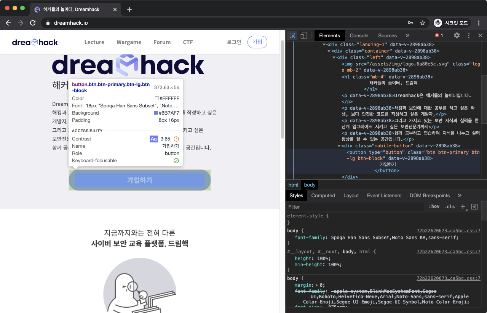

# **DevTools Layout(2)**

## **요소 검사**

**요소 검사**를 활용하면?

 특정 요소의 개괄적인 정보를 파악하고, 이와 관련된 코드를 쉽게 찾을 수 있다.

요소 검사 버튼을 누르고 웹 페이지의 원하는 요소에 마우스를 올리면, 대상의 정보가 출력된다. 그 상태에서 클릭하면 이와 관련된 HTML 코드가 하이라이팅 된다.

