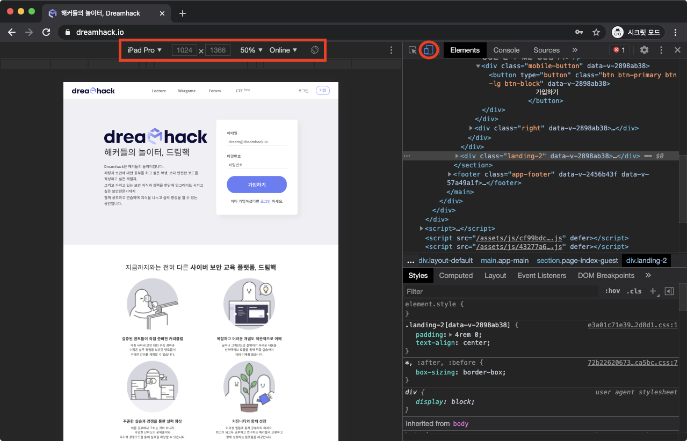

# **DevTools Layout(3)**

## 디바이스 툴바

**디바이스 툴바**를 활용하면?

브라우저의 화면 비율 및 User-Agent를 원하는 값으로 변경할 수 있다.

<aside>
💡 현대에는 웹에 접속하는 장치가 다양해지고 있으며, 웹 페이지가 랜더링되어야 할 화면 비율도 가지각색으로 많아지고 있다.

</aside>

#
또한 개발자들은 사용자들에게 좋은 웹 경험을 줘야하므로 자신이 개발한 웹 서비스가 다른 디바이스에서도 잘 작동하는지 점검해봐야 하는데 이때 디바이스 툴바를 이용하면 점검들을 쉽게 진행할 수 있다.

이미지 출처 : dreamhack.io