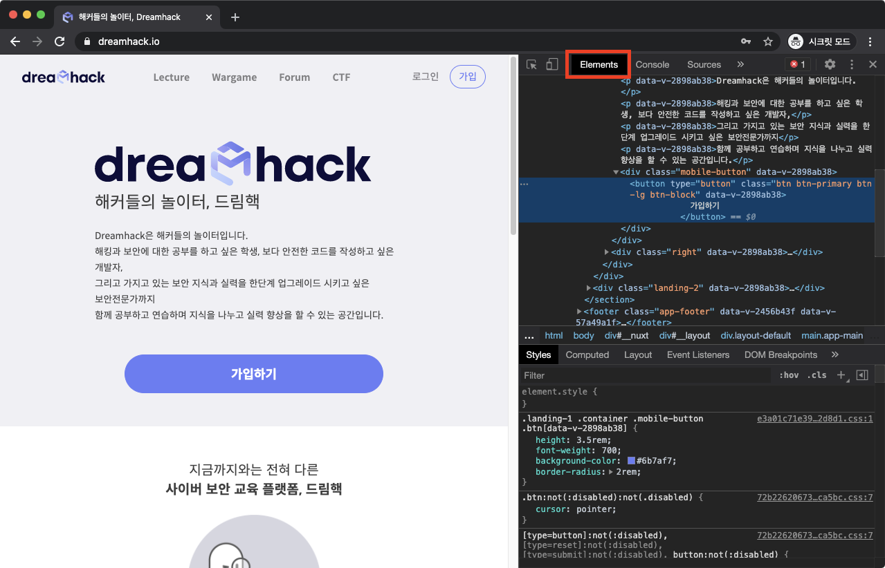
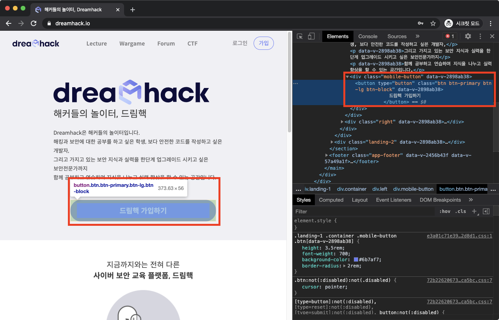

# **DevTools Layout(4)**

## **Elements**

현재 페이지를 구성하는 HTML의 코드를 읽을 수 있다.

## **HTML 수정**

코드를 선택한 상태로 단축키 **F2**를 누르거나 **더블 클릭**하면, 이를 수정할 수 있다.

**요소검사**(DevTools Layout (2)참고)를 이용하면 수정할 코드를 빠르게 선택할 수 있다.

이미지 출처 : dreamhack.io