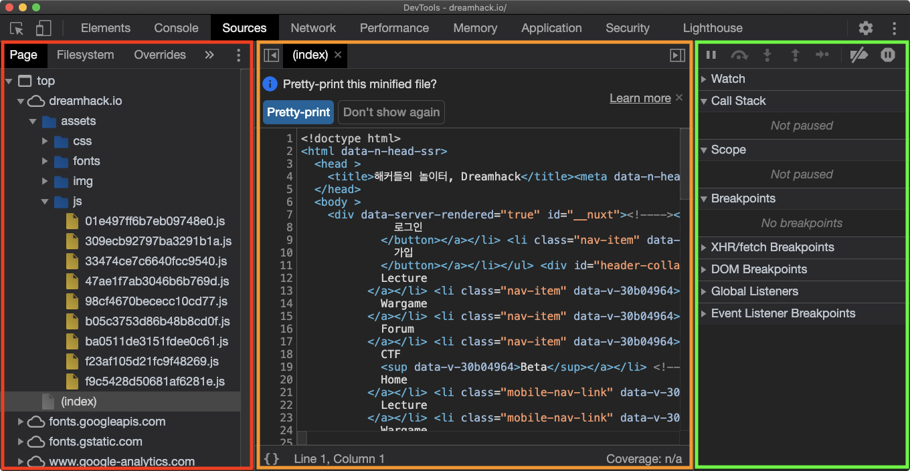

# **DevTools Layout(6)**

## **Sources**

**Sources는**  

**현재 페이지를 구성하는 웹 리소스들을 확인할 수 있게 해준다.**
#

## **Sources 레이아웃**

🔴 **빨간색**

현재 페이지의 리소스 파일 트리, 파일 시스템

🟠 **주황색**

선택한 리소스 상세 보기

🟢 **초록색**

디버깅 정보

- Watch: 원하는 자바스크립트 식을 입력하면, 코드 실행 과정에서 해당 식의 값 변화를 확인할 수 있다.
- Call Stack: 함수들의 호출 순서를 스택 형태로 보여준다. 예를 들어, `A → B → C` 순서로 함수가 호출되어 현재 `C` 내부의 코드를 실행하고 있다면, Call Stack의 가장 위에는 `C`, 가장 아래에는 `A`가 위치한다.
- Scope: 정의된 모든 변수들의 값을 확인할 수 있다.
- Breakpoints: 브레이크포인트들을 확인하고, 각각을 활성화 또는 비활성화할 수 있다.
