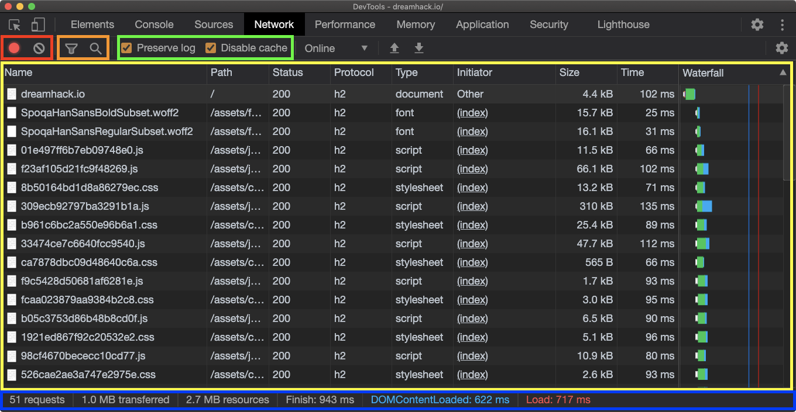
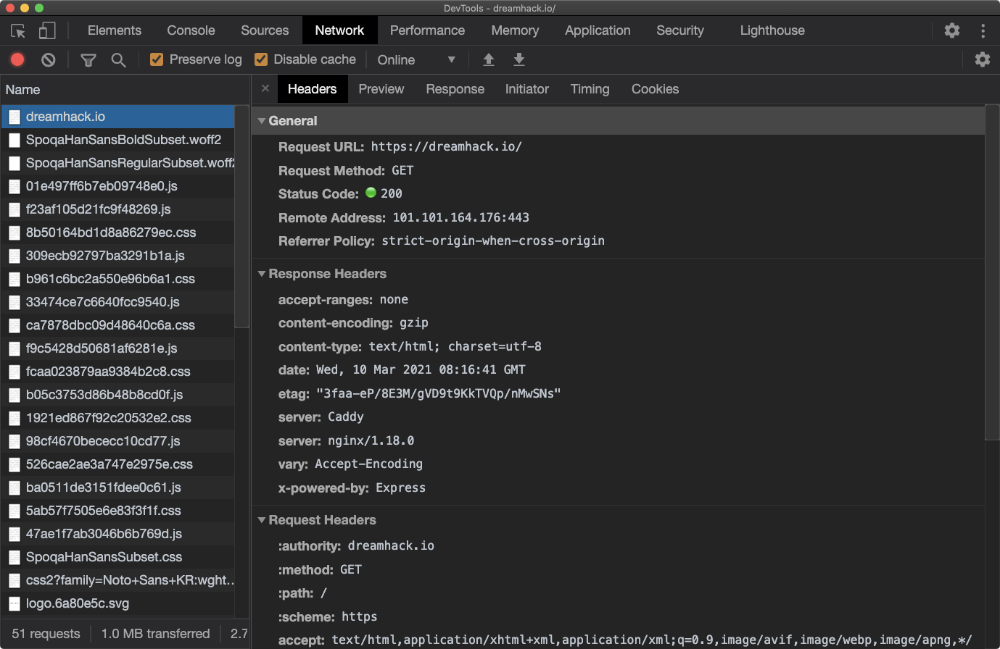

# DevTools Layout(7)

## Network

**Network는**  

**서버와 오가는 데이터를 확인할 수 있다.**
#

🔴 **빨간색**

로깅 중지 및 로그 전체 삭제

🟠 **주황색**

로그 필터링 및 검색

🟢 **초록색**

옵션

- Preserve log: 새로운 페이지로 이동해도 로그를 삭제하지 않는다.
- Disable cache: 이미 캐시된 리소스도 서버에 요청한다.

🟡 **노란색**

네트워크 로그

🔵 **파란색**

네트워크 로그 요약 정보
#

원하는 항목을 선택하면 해당 요청 및 응답 데이터를 확인할 수 있다.

