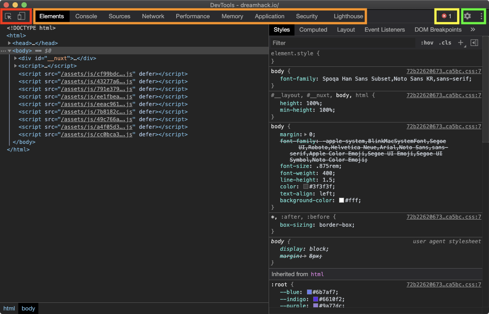

# **DevTools Layout**

### **Figure 1. 개발자도구 레이아웃**

개발자 도구를 실행하려면 브라우저를 열고, F12를 누른다.

그러면 개발자 도구 창이 브라우저에 나타난다.

Figure1에서 개발자 도구의 간단한 레이아웃 정보를 확인할 수 있다.

다음은 개발자 도구 창의 모습이다.

🔴 빨간색

요소 검사(Inspect) 및 디바이스 툴바(Device Toolbar)

🟠 주황색(기능을 선택하는 패널)

- **Elements**: 페이지를 구성하는 HTML 검사
- **Console**: 자바 스크립트를 실행하고 결과를 확인할 수 있음
- **Sources**: HTML, CSS, JS 등 페이지를 구성하는 리소스를 확인하고 디버깅할 수 있음
- **Network**: 서버와 오가는 데이터를 확인할 수 있음
- **Application**: 쿠키를 포함하여 웹 어플리케이션과 관련된 데이터를 확인할 수 있음

🟡 노란색

현재 페이지에서 발생한 에러 및 경고 메시지

🟢 녹색

개발자 도구 설정

이미지 출처 : dreamhack.io
